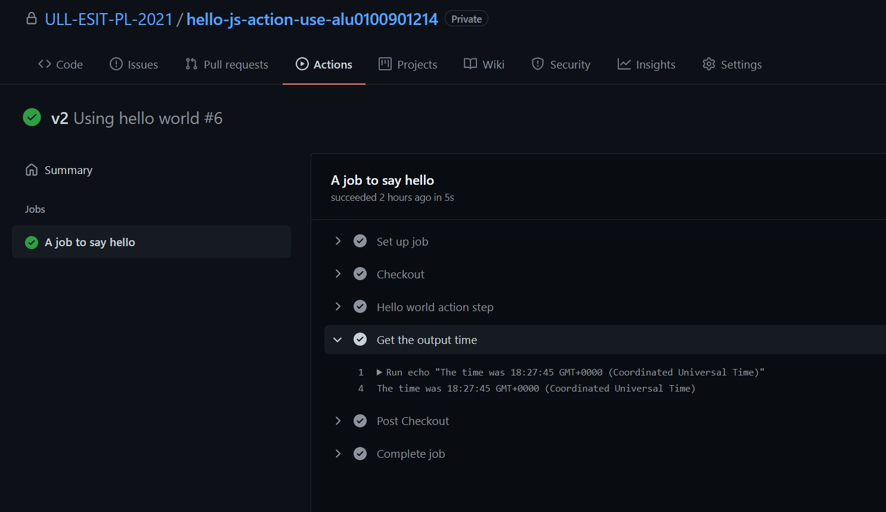

# hello-js-action-super

## Introducción

La práctica consiste en crear nuestra propia acción con una prueba sencilla que nos imprime un "Hello World!" o un "Hello (y un nombre que le pasemos)"

## Archivo metadata

Lo primero que crearemos sera un archivo .yml que ejecuta la acción, en este describimos los input y los output:

### Input

El input de nuestra acción sera el nombre de la persona a la que queremos saludar:

```
inputs:
  who-to-greet:  # id of input
    description: 'Who to greet'
    required: true
    default: 'World'
```

Dentro de este apartado tenemos:
* El id del imput 'who-to-greet'
* Una descripción
* En required le indicamos se es necesario el parámetro
* Y en caso de que no se proporcione una entrada tenemos como por defecto 'World'

### Output

El output de nuestra acción sera la hora exacta en la que hemos ejecutado nuestra acción:

```
outputs:
  time: # id of output
    description: 'The time we greeted you'
```

En este apartado tenemos:
* El id del output 'time'
* La descripción del output

Por último en el apartado 'runs' se especifica como ejecutar el archivo principal 'index.js'.

## Action toolkit packages

En esta práctica usaremos un conjunto de paquetes de Node.js para construir acciones de forma más sencilla:

### @actions/core 

La acción Core, nos permite usar comandos para el workflow, usar variables de input y output, estados de salida y mensajes de debug.

### @actions/github

La acción github, nos ofrece un cliente REST de Octokit autenticado y acceso al Github actions contexts.

## Código de la acción

Añadimos el archivo '/src/index.js' al repositorio con el siguiente código:

```
const core = require('@actions/core');
const github = require('@actions/github');

try {
  // `who-to-greet` input defined in action metadata file
  const nameToGreet = core.getInput('who-to-greet');
  console.log(`Hello ${nameToGreet}!`);
  const time = (new Date()).toTimeString();
  core.setOutput("time", time);
  // Get the JSON webhook payload for the event that triggered the workflow
  const payload = JSON.stringify(github.context.payload, undefined, 2)
  console.log(`The event payload: ${payload}`);
} catch (error) {
  core.setFailed(error.message);
}
```

Requerimos core y github en las 2 primeras lineas del código.
Primero hacemos core.getInput('who-to-greet'), para obtener la variable de core.
Despues recogemos la fecha actual y la guardamos en time, para despues volver a usar core para establecerlo como una variable de salida.
Estas variables son usadas despues por la acción para poder ejecutarse.

Github nos puede dejar información sobre el webhook, los git refs, las acciones entre otros, para acceder a dicha información podemos usar el paquete github con la que podemos escribir un log del webhook event (esta información se encuentra en 'github.context.payload' ).

Para llevar el manejo de errores de index.js, usamos el toolkit de core para mostrar un mensaje de error y dar una salida de error al código con 'core.setFailed(error.message)'


## Probando nuestra acción

En nuestro segundo repositorio 'hello-js-action-use-alu0100901214', probaremos nuestra acción.
Primero añadimos el archivo '.github/workflows/main.yml' al repositorio y añadimos los pasos necesarios para la ejecución de nuestra acción:

```
      - name: Hello world action step
        uses: ULL-ESIT-PL-2021/hello-js-action-alu0100901214@v2
        id: hello
        with:
          who-to-greet: 'Sergio'
      # Use the output from the `hello` step
      - name: Get the output time
        run: echo "The time was ${{ steps.hello.outputs.time }}"
```

El primer paso 'Hello world action step' indicamos que vamos a usar la acción de nuestro repositorio 'ULL-ESIT-PL-2021/hello-js-action-alu0100901214@v2', debido a algunos errores, he necesitado subir la versión del tag a v2.
* Indicamos la id del paso como 'hello'
* Y indicamos el valor de la variable 'who-to-greet' con mi nombre.

En el segundo paso 'Get the output time' usamos la salida del paso anterior, 'hello' y sacamos la fecha en la que se ha ejecutado dicho paso.
* En 'run:' le indicamos que ejecute un 'echo' imprimiendo la fecha.


Una vez terminado, subimos los archivos al repositorio y comprobamos que todo funcione:



# Super repositorio

Enlazamos como submodulos los dos repositorios en un super repositorio como en la práctica anterior:


